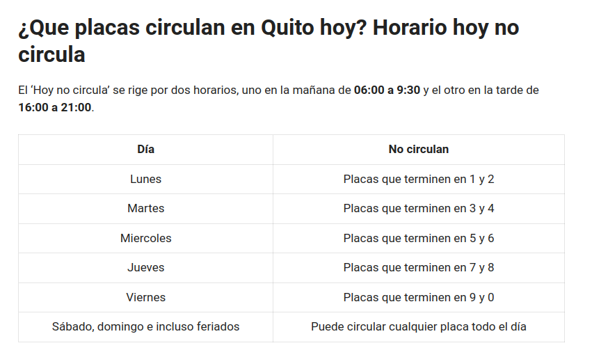

# Descripcion

Aplicacion de Springboot y react dockerizada

# Pre-requisitos

Docker y docker-compose es requerido

# Uso

1. Clonar el repositorio
2. Ingresar a la carpeta del repositorio
3. Ejecutar el comando `make up`
4. Esperar a que se pongan en marcha los servicios
5. Visitar: http://localhost:1337/
6. Ejecutar el comando `make down` para detener los servicios

# Reglas de no circula
